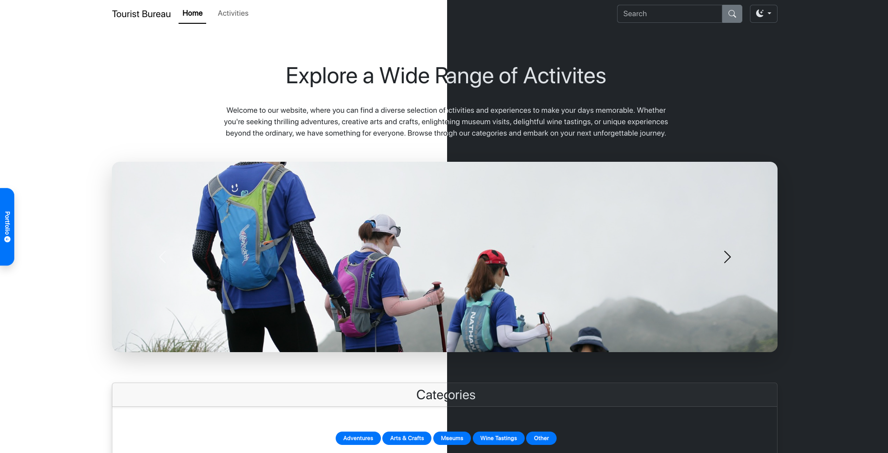
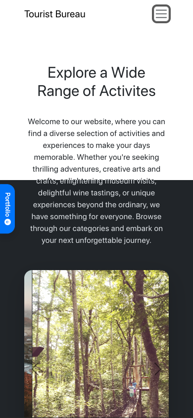
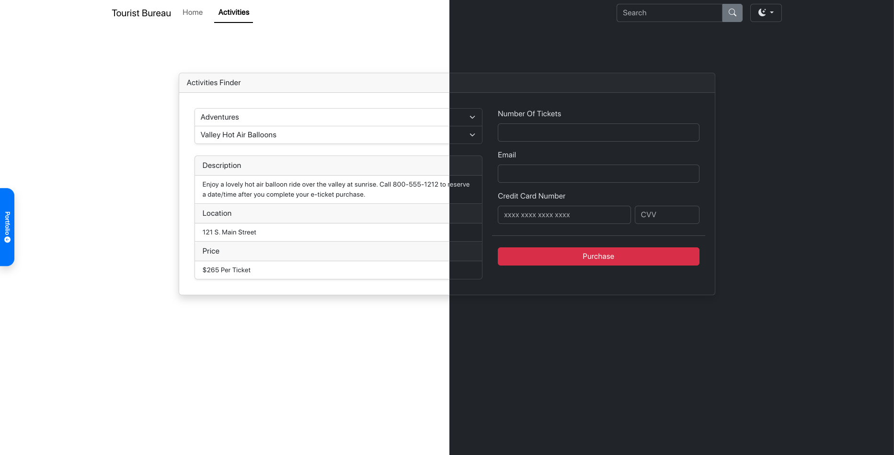
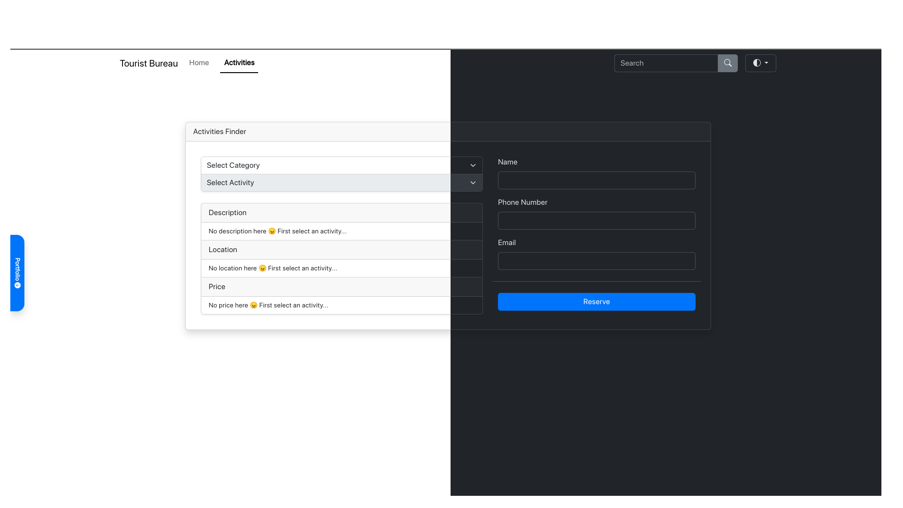
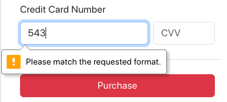
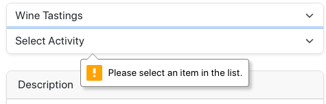
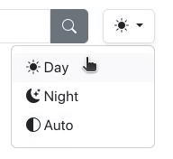
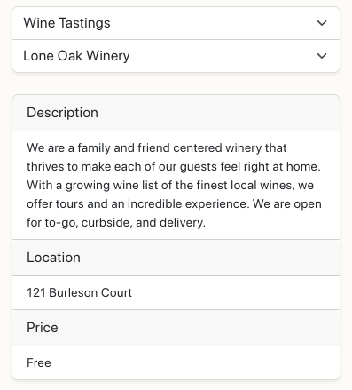

# Tourist Bureau

*Responsive tourist website demonstrating dynamic populating and filtering of dropdown menus built with **Javascript** **HTML** **Bootstrap** and **CSS** Deployed using Github Pages*

> Landing Page [https://joncgroberg.github.io/Workbook4_TouristBureau/activities.html](https://joncgroberg.github.io/Workbook4_TouristBureau/)

> Activity Finder [https://joncgroberg.github.io/Workbook4_TouristBureau/activities.html](https://joncgroberg.github.io/Workbook4_TouristBureau/activities.html)


### Landing Page

#### Desktop View



- Dark & Light Modes
- Image carousel displaying activites

#### Mobile View



- Collapsing Navbar

### Category Page

- Activity dropdown list autopopulates based on category dropdown value
- Payed or free activity inputs are disabled/hidden or enabled/shown based on activity.
- Unique purchase/reserve user toast message

#### Payed Activities



#### Free Activities



#### User Toast


### User Experience

- Consistent navigation and theme including toggleable **Dark Mode** (set to `auto` by default)
- **Focus** automatically on the first input field
- Monetary values rounded to **2 decimal** point values and include **$** where needed
- Abilty to clear input using a `reset` button
- Calculation animation
- Inability to enter bad data using **input restriction**

  
  


### Technical

- Uses `readonly` on output form fields
- Appropriate **branch** structure and **commit** history
- Screen shots
  - **Each** page that shows inputs and correct outputs
  - Erroneous inputs and an error message.
- Documentation of **notable** pieces of code.
- Helper functions **moved** to external `helperFuctions.js` file
  ```javascript
  import {
    removeAllOptions,
    appendFilteredOptions,
    defaultLabels,
    muted,
    setElementsAvailibilty,
    toastUser,
  } from "./helperFunctions.js";
  ```

### Notable Features

#### Dark/Light/Auto Theme Toggle



```Javascript
const setTheme = (theme) => {
  if (
    theme === "auto" &&
    window.matchMedia("(prefers-color-scheme: dark)").matches
  ) {
    setStoredTheme("dark");
    for (const key in icons) {
      if (key != theme) toggleIcon.classList.remove(icons[key]);
    }
    toggleIcon.classList.add(icons[theme]);
    document.documentElement.setAttribute("data-bs-theme", "dark");
  } else {
    setStoredTheme(theme);
    for (const key in icons) {
      if (key != theme) toggleIcon.classList.remove(icons[key]);
    }
    toggleIcon.classList.add(icons[theme]);
    document.documentElement.setAttribute("data-bs-theme", theme);
  }
};
```

#### Vertical Bootstrap Card Group

- **Vertical** Bootstrap Card Group functions similary to the standared standard bootstrap horizontal card group

- Rounded and border only of the outside cards and borders between middle cards



```CSS
    .card-group-vertical {
        border: 1px solid rgba(0, 0, 0, .125);
        border-radius: 8px;
        overflow: hidden;}

    .card-group-vertical>.card {
        width: 100%;
        border-width: 1px 0px 0px 0px;
        border-radius: 0px;
    }
    .card-group-vertical>.card:first-child {
        border-top-width: 0px;
        border-radius: 0px 0px 0px 0px;
    }

    .card-group-vertical>.card:last-child {
        border-bottom-width: 0px;
        border-radius: 0px 0px 4px 4px;
    }
```

### Credits

- `darkmode.js` is forked from the bootstrap website
