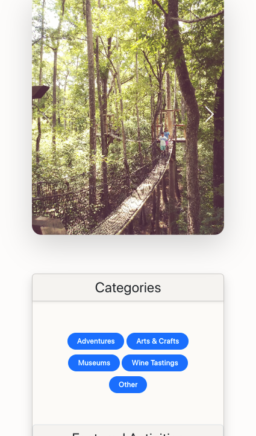

#  Tourist Bureau

Responsive website tourist website demonstrating dynamic populating and filtering of dropdown menus built with **Javascript** **HTML** **Bootstrap** and **CSS**

<!-- TOC start -->

## Table of Contents

- [Tourist Bureau](#tourist-bureau)
  - [Table of Contents](#table-of-contents)
  - [Live Site](#live-site)
- [Features](#features)
    - [User Experience](#user-experience)
  - [Pages](#pages)
    - [Landing Page](#landing-page)
      - [Desktop View](#desktop-view)
      - [Mobile View](#mobile-view)
    - [Category Page](#category-page)
      - [Payed Activities](#payed-activities)
      - [Free Activities](#free-activities)
      - [User Toast](#user-toast)
    - [Technical](#technical)
    - [Notable Feature](#notable-feature)
      - [Code](#code)
      - [Demonstration](#demonstration)
      - [Code](#code-1)

<!-- TOC end -->

## Live Site

> Landing Page [https://joncgroberg.github.io/Workbook4_TouristBureau/activities.html](https://joncgroberg.github.io/Workbook4_TouristBureau/)

> Activity Finder [https://joncgroberg.github.io/Workbook4_TouristBureau/activities.html](https://joncgroberg.github.io/Workbook4_TouristBureau/activities.html)

# Features

### User Experience

- Consistent navigation and theme
- **Focus** automatically on the first input field
- Monetary values rounded to **2 decimal** point values and include **$** where needed
- Abilty to clear input using a `reset` button
- Calculation animation
- Inability to enter bad data using **input restriction**

  
  

## Pages

### Landing Page

#### Desktop View


#### Mobile View



- Inputs of **principal**, **interest** rate, and **loan length** entered by the user
- Outputs the **expected monthly payment** and **total interest** paid

### Category Page

#### Payed Activities


#### Free Activities


#### User Toast


### Technical

- Uses `readonly` on output form fields
- Appropriate **branch** structure and **commit** history
- Screen shots
  - **Each** page that shows inputs and correct outputs
  - Erroneous inputs and an error message.
- Documentation of **notable** pieces of code.

### Notable Feature

- **Vertical** Bootstrap Card Group based on the standared horizontal card group

  - Rounded and border only of the outside cards and borders between middle cards

  #### Code

  ```CSS
      .card-group-vertical {
          border: 1px solid rgba(0, 0, 0, .125);
          border-radius: 8px;
          overflow: hidden;}

      .card-group-vertical>.card {
          width: 100%;
          border-width: 1px 0px 0px 0px;
          border-radius: 0px;
      }
      .card-group-vertical>.card:first-child {
          border-top-width: 0px;
          border-radius: 0px 0px 0px 0px;
      }

      .card-group-vertical>.card:last-child {
          border-bottom-width: 0px;
          border-radius: 0px 0px 4px 4px;
      }
  ```

  #### Demonstration

  

- Helper functions **moved** to external `helperFuctions.js` file
  #### Code
  ```javascript
  import {
    removeAllOptions,
    appendFilteredOptions,
    defaultLabels,
    muted,
    setElementsAvailibilty,
    toastUser,
  } from "./helperFunctions.js";
  ```
